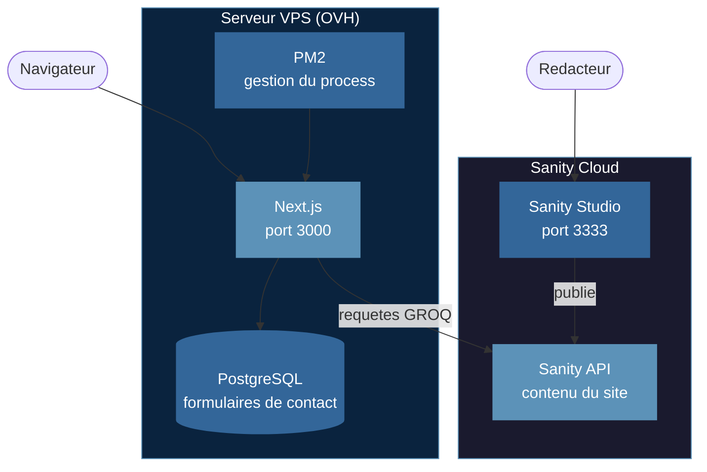

# Architecture du projet

## Vue d'ensemble

Le site est composé de trois parties qui travaillent ensemble.



- **Next.js** construit et affiche le site.
- **Sanity** stocke le contenu du site (textes, images). Les rédacteurs l'utilisent pour mettre à jour le contenu sans toucher au code.
- **PostgreSQL** stocke les données envoyées par les visiteurs (formulaires de contact).

---

## Chaque partie en détail

### Next.js

C'est l'application principale. Le code est dans `src/`.

- Les pages sont dans `src/app/`.
- Next.js va chercher le contenu chez Sanity, puis l'affiche.
- Next.js enregistre les formulaires de contact dans PostgreSQL.
- En production, il tourne sur le serveur VPS avec PM2 (un outil qui garde l'application en vie).

### Sanity

C'est le CMS (outil de gestion de contenu). Les rédacteurs écrivent les textes et publient les images depuis une interface web appelée **Sanity Studio**.

- Le code du Studio est dans `studio/`.
- Pour le lancer en local : `cd studio && npm run dev` → s'ouvre sur `http://localhost:3333`.
- Next.js récupère le contenu de Sanity via des requêtes GROQ (voir `docs/sanity.md`).

### PostgreSQL

Une base de données classique sur le serveur.

- Elle sert uniquement à stocker les messages envoyés via le formulaire de contact.
- Le modèle de données est dans `prisma/schema.prisma`.
- Pour accéder à la base de données dans le code, utiliser `src/lib/db/index.ts` — ne pas créer un autre client.

---

## Les environnements

| Environnement | Branche   | URL                    | Dataset Sanity |
|---------------|-----------|------------------------|----------------|
| Local         | `dev`     | `localhost:3000`       | `production`   |
| Préproduction | `staging` | `staging.trinexta.com` | `production`   |
| Production    | `main`    | `trinexta.com`         | `production`   |

> Le staging utilise le même contenu Sanity que la production. Cela évite de dupliquer le contenu. Le dataset `staging` existe mais n'est pas activé pour l'instant.

---

## Déploiement automatique

```
git push origin staging  ──► GitHub Actions ──► Connexion SSH au serveur
                                                  git pull
                                                  npm ci
                                                  npm run build
                                                  pm2 reload trinexta
```

Même chose pour `main`. Le fichier de configuration est `.github/workflows/deploy.yml`.

---

## Lancer le projet en local

Deux terminaux :

```bash
# Terminal 1 — site web
npm run dev        # http://localhost:3000

# Terminal 2 — éditeur de contenu
cd studio
npm run dev        # http://localhost:3333
```

PostgreSQL doit être démarré sur votre machine avant de lancer Next.js (voir README).
